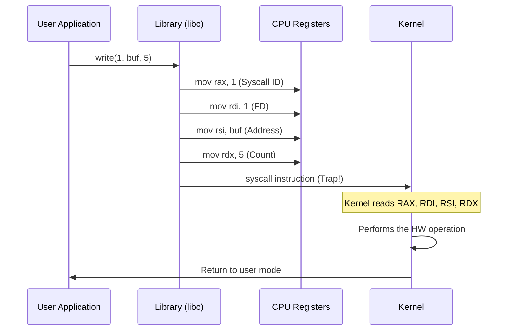

btw how a simple function call in C like `write()` actually tells the operating system (OS) what to do? This process is known as **System Call Parameter Passing**.

A system call is a bridge between **User Space** (where your program lives) and **Kernel Space** (where the OS lives). Because your program isn't allowed to touch the hardware directly, it must "ask" the kernel for help.

### The communication hierarchy:

1.  **High Level (Library Function)**: You call `printf("Hello")`.
2.  **Mid Level (Syscall Wrapper)**: `libc` (the C Standard Library) translates `printf` into a `write()` call.
3.  **Low Level (The Trap)**: `libc` prepares the CPU **registers** and executes a special instruction (like `syscall` or `int 0x80`) to jump into the kernel.

---

## How Parameters are Passed (x86-64 Linux)

When I call `write(1, "Hello", 5);`, the computer doesn't just "send" the values. It puts them in specific "buckets" called **Registers** inside the CPU.

| Parameter | Register | Description |
| :--- | :--- | :--- |
| **Syscall ID** | `rax` | Which syscall? (1 = `write`) |
| **Arg 1 (FD)** | `rdi` | Where to write? (1 = stdout) |
| **Arg 2 (Buf)**| `rsi` | What to write? (Address of "Hello") |
| **Arg 3 (Len)**| `rdx` | How many bytes? (5) |

### The Flow:

## Summary
The library functions are just **wrappers**. Their main job is to take your nice C arguments and shove them into the CPU registers so the Kernel can read them after the `syscall` instruction triggers a mode switch.

Check out [syscall_example.c](https://github.com/YeisraelD/C-Sup/tree/main/OS%20systemcall%20parameter%20passing) to see this in action!

## What's the difference between these 3?

In the [syscall_example.c](https://github.com/YeisraelD/C-Sup/tree/main/OS%20systemcall%20parameter%20passing), I show three ways to write to the screen. Here's why they are different:

### 1. `printf()` (High-Level Library)
*   **Abstraction**: Highest. It knows how to format different data types (like `%d` or `%f`).
*   **Buffering**: It is **buffered**. It waits until it has a full line of text before actually asking the kernel for help. This makes it very fast for frequent small messages.
*   **Portability**: The most portable. It works on almost every C compiler on every platform.

### 2. `write()` (Mid-Level POSIX Wrapper)
*   **Abstraction**: Medium. It only knows how to send raw "bags of bytes" to a file or device.
*   **Buffering**: It is **unbuffered**. Every time I call `write()`, it immediately traps into the kernel.
*   **Portability**: Works on Linux, Mac, and Unix-like systems, but not natively on Windows.

### 3. `syscall()` (Low-Level Manual Pass)
*   **Abstraction**: Lowest. This is the rawest form. I am manually choosing the Syscall ID (e.g., `1` for `write`).
*   **Registers**: This is where I explicitly see the **parameter passing** to the kernel registers (`rax`, `rdi`, etc.).
*   **Use Case**: I only use this when a new syscall is so new that `libc` doesn't have a `write()` style wrapper for it yet.
